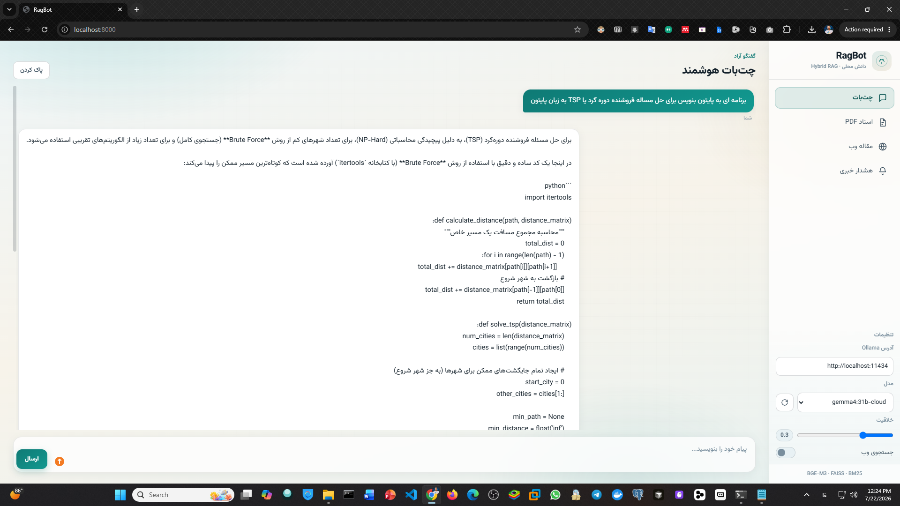
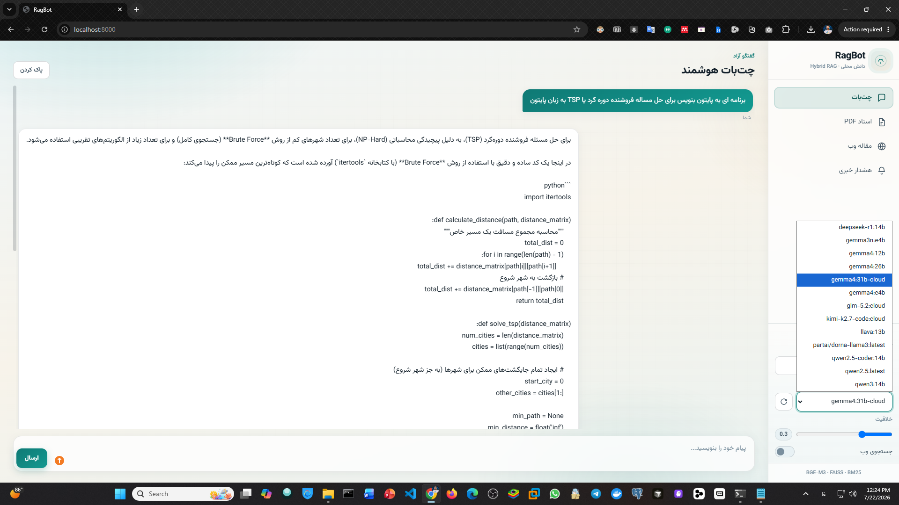
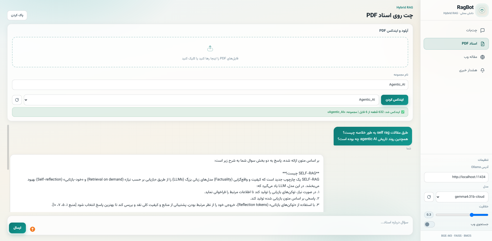
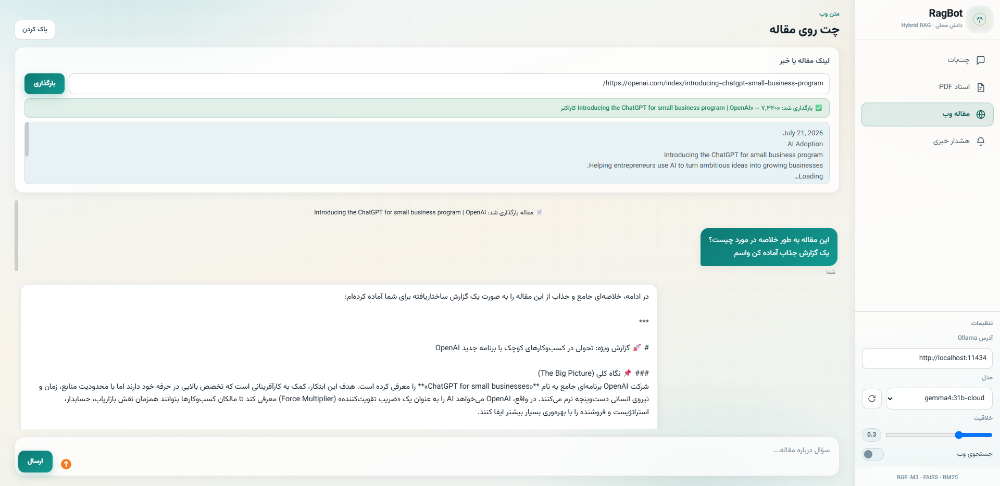
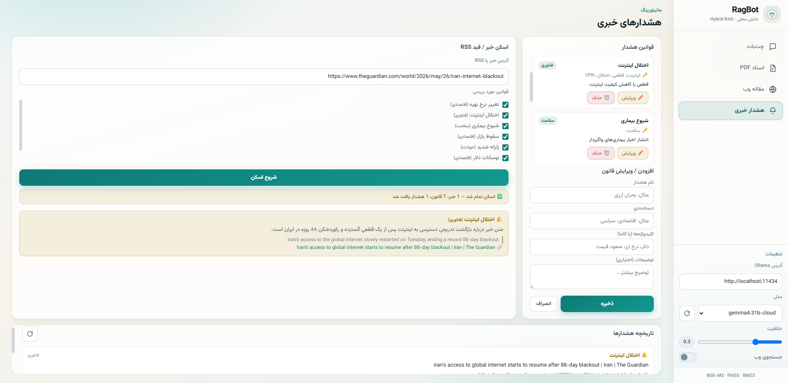

# RagBot

A locally-hosted RAG (Retrieval-Augmented Generation) system with a decoupled Backend / Frontend architecture.

| Layer | Technology |
|-------|------------|
| Backend | FastAPI + SSE streaming |
| Frontend | HTML / CSS / JS (RTL, no build step) |
| Vector Store | **FAISS** (on-disk) |
| Retrieval | **Hybrid**: Dense (FAISS) + Sparse (BM25) + RRF |
| Embedding | **BAAI/bge-m3** (local) |
| LLM | Ollama (local) |
| Alerts Store | SQLite |

---

## LLM: RAG Chat Bot

<div align="center">

<details open>
<summary><b>Rag Bot</b></summary>
<br>

</details>

<details>
<summary><b>Ranked Retrieval and Create Vector Database</b></summary>
<br>

</details>

<details>
<summary><b>RChatBot Oon PDFs Files with Hybrid RAG</b></summary>
<br>

</details>

<details>
<summary><b>ChatBot on web article</b></summary>
<br>

</details>

<details>
<summary><b>LLM-based news alert system</b></summary>
<br>

</details>

</div>

---

## Project Structure

```
RagBot/
├── models/
│   └── bge-m3/              ← Embedding model (downloaded separately)
├── scripts/
│   └── download_embedding.py
├── backend/
│   ├── main.py
│   ├── requirements.txt
│   ├── routers/
│   └── services/
│       ├── embeddings.py    ← BGE-M3
│       ├── vectorstore.py   ← FAISS + docs.pkl
│       ├── retrieval.py     ← Hybrid BM25 + FAISS
│       └── rag_chain.py
└── frontend/
    ├── index.html
    ├── css/style.css
    └── js/
```

---

## Prerequisites

- Python **3.11+**
- [Ollama](https://ollama.com/download) installed and running
- LLM model pulled: `ollama pull qwen2.5:14b`
- (Optional) CUDA-capable GPU for faster embedding generation

---

## 1) Install Dependencies

```powershell
cd RagBot\backend
python -m venv venv
.\venv\Scripts\activate
```

### GPU Setup (PyTorch + CUDA)

`torch` is intentionally **not** listed in `requirements.txt`, since the plain PyPI build is CPU-only and would silently override a GPU-enabled install. Install it manually first, before the rest of the dependencies.

**Check your driver's CUDA version:**

```powershell
nvidia-smi
```

The top-right of the output shows something like `CUDA Version: 12.x` — this is the maximum CUDA version your driver supports.

**Install the CUDA build matching your driver** (example for CUDA 12.1):

```powershell
pip install torch torchvision torchaudio --index-url https://download.pytorch.org/whl/cu121
```

If `nvidia-smi` reports CUDA 11.8 instead, use:

```powershell
pip install torch torchvision torchaudio --index-url https://download.pytorch.org/whl/cu118
```

**Verify GPU is detected:**

```powershell
python -c "import torch; print(torch.cuda.is_available()); print(torch.cuda.get_device_name(0))"
```

A successful setup prints `True` followed by your GPU's name.

> **No NVIDIA GPU?** Skip this section — `sentence-transformers` will install a CPU-only `torch` automatically as a dependency in the next step.

### Install the Remaining Dependencies

```powershell
pip install -r requirements.txt
```

`sentence-transformers` will detect the `torch` build already installed (GPU or CPU) and use it as-is — no separate configuration is needed for BGE-M3 to run on GPU.

---

## 2) Download the Embedding Model (BGE-M3)

The model is approximately **2 GB** and must be placed at `models/bge-m3`.

### Recommended — Project Script

From the project root (`RagBot`):

```powershell
.\backend\venv\Scripts\activate
python scripts\download_embedding.py
```

### Alternative — Git + Git LFS (Hugging Face)

The model repository can be cloned from Hugging Face via Git:

```powershell
# Install Git LFS: https://git-lfs.com
git lfs install
cd RagBot
git clone https://huggingface.co/BAAI/bge-m3 models\bge-m3
```

### Alternative — huggingface-cli

```powershell
pip install huggingface-hub
huggingface-cli download BAAI/bge-m3 --local-dir models\bge-m3
```

After downloading, the directory structure should look like this:

```
RagBot/models/bge-m3/
  ├── config.json
  ├── modules.json
  ├── pytorch_model.bin   (or model.safetensors)
  └── ...
```

> **Note:** If you previously built your index with E5, you must re-index your PDFs after switching to BGE-M3, since embeddings from different models are not compatible with one another.

---

## 3) Run the Backend

```powershell
cd RagBot\backend
.\venv\Scripts\activate
uvicorn main:app --reload --port 8000
```

- Web UI: http://localhost:8000
- API docs: http://localhost:8000/docs
- Health check: http://localhost:8000/api/health

The frontend is served directly by FastAPI from the `frontend` folder — no separate server is required.

---

## Modules

### Chat Bot
Connects to Ollama, supports model selection, web search (DuckDuckGo), and SSE streaming.

### Chat over PDF Documents (RAG)
Upload multiple PDFs, indexed with **BGE-M3 + FAISS**, retrieved via hybrid **BM25 + Dense + RRF** search, with source citations displayed alongside each response.

### Chat over an Article
Fetches content from a URL and enables conversation grounded in that content.

### News Alerts
Keyword-based alert rules, URL/RSS scanning with LLM-based matching, and results stored in SQLite.

---

## Core API Endpoints

| Method | Path | Description |
|--------|------|-------------|
| POST | `/api/chat/stream` | Stream chat response |
| POST | `/api/chat/models` | List available Ollama models |
| POST | `/api/rag/index/stream` | Upload and index a PDF (SSE) |
| POST | `/api/rag/chat/stream` | Stream RAG chat response |
| GET  | `/api/rag/collections` | List indexed collections |
| POST | `/api/article/fetch` | Fetch article content |
| POST | `/api/article/chat/stream` | Stream chat over an article |
| GET/POST/PUT/DELETE | `/api/alerts/rules` | Manage alert rules |
| POST | `/api/alerts/scan` | Scan a news source |
| GET  | `/api/alerts/results` | Retrieve alert history |

---

## RAG Implementation Details

- **Chunking:** 1000-character chunks with 150-character overlap, using Persian-aware delimiters
- **Dense retrieval:** FAISS `IndexFlatIP` over normalized vectors (equivalent to cosine similarity)
- **Sparse retrieval:** BM25 over the same chunks
- **Fusion:** Reciprocal Rank Fusion (RRF)
- **Output:** Top `k` chunks (default: 8) are passed to the LLM as context